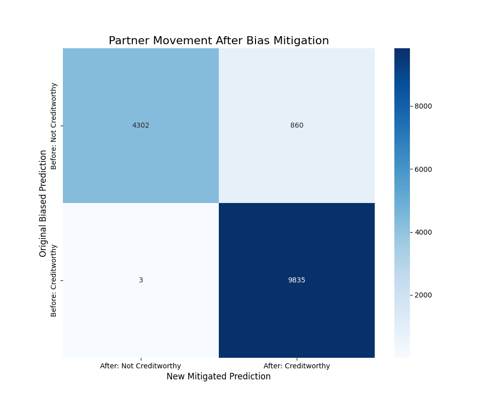

# Project-Nova 🤖

## Introduction

**Project-Nova** is a project that demonstrates the process of identifying and mitigating bias in a machine learning model. The project focuses on a scenario of predicting the creditworthiness of partners, where the initial dataset contains inherent biases based on gender and geographic location.


This notebook walks through the following key steps:
1.  **Generation of a biased dataset:** A synthetic dataset is created with intentional biases to simulate a real-world scenario.
2.  **Bias detection and analysis:** The biases in the dataset are verified and analyzed.
3.  **Model training:** A predictive model is trained on the biased dataset.
4.  **Bias mitigation:** A mitigation technique is applied to the model's predictions to ensure fairness.
5.  **Evaluation of mitigation impact:** The effect of the bias mitigation is analyzed and visualized.


---

## ✨ Features

-   **Synthetic Data Generation:** Generates a custom dataset with controllable biases.
-   **Bias Verification:** Provides statistical verification of the introduced biases.
-   **Creditworthiness Prediction:** Trains a model to predict whether a partner is creditworthy.
-   **Bias Mitigation:** Implements a post-processing technique to mitigate bias in the model's predictions.
-   **Impact Visualization:** Visualizes the impact of the mitigation process, showing how many partners' classifications were changed to achieve fairness.

---

## 🚀 How to Run

1.  **Clone the repository:**
    ```bash
    git clone [https://github.com/Samridh-Minocha007/Project-Nova.git](https://github.com/Samridh-Minocha007/Project-Nova.git)
    ```
2.  **Navigate to the project directory:**
    ```bash
    cd Project-Nova
    ```
3.  **Install the required dependencies:**
    ```bash
    pip install pandas numpy scikit-learn matplotlib seaborn
    ```
4.  **Open and run the Jupyter Notebook:**
    ```bash
    jupyter notebook nova_prototype_new.ipynb
    ```

---

## ⚙️ Dependencies

The project requires the following Python libraries:

-   `pandas`
-   `numpy`
-   `scikit-learn`
-   `matplotlib`
-   `seaborn`

You can install all the dependencies by running the command in the "How to Run" section.

---

## 📊 Results

The notebook generates several outputs, including:

-   A biased dataset saved as `nova_custom_biased_dataset.csv`.
-   Verification of biases in the dataset, showing disparities in earnings and GMV based on gender and location.
-   A visualization of the impact of bias mitigation in the form of a movement matrix, which shows how many partners were upgraded or downgraded to ensure fairness.

Here is an example of the mitigation impact matrix generated by the notebook:



This matrix clearly shows how many partners were moved from "Not Creditworthy" to "Creditworthy" and vice-versa after applying the bias mitigation technique.

## 📫 Contact

Project created by **Sarthak Jain** - feel free to reach out!

-   **GitHub:** [Sarthak-144](https://github.com/sarthak-144)
-   **LinkedIn:** `https://www.linkedin.com/in/sarthak-jain-07812328b/`

## 📜 License

This project is licensed under the MIT License. See the [LICENSE](LICENSE.md) file for details.
