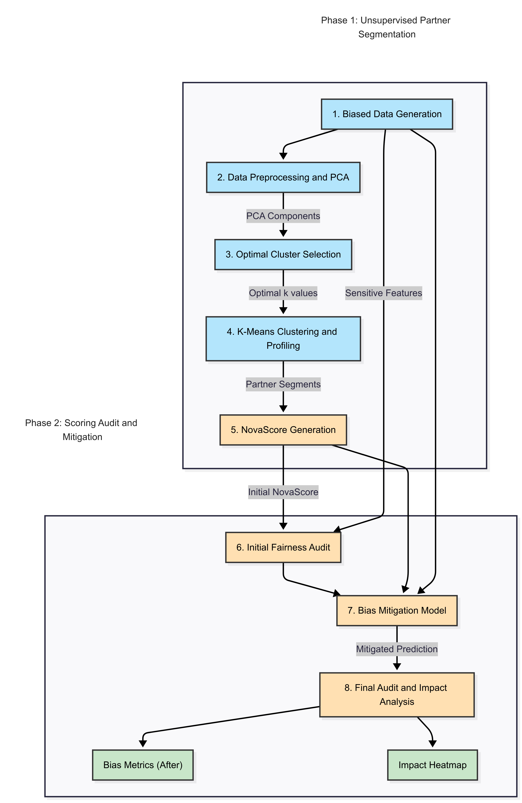

# Project-Nova 🤖

### 🚀 [View the Live Demo on Streamlit](https://nova-score-pred.streamlit.app/)

---

## Introduction

Many gig economy workers, despite having consistent income, are "**credit invisible**." They lack the formal credit histories required by traditional financial institutions, creating a significant barrier to accessing loans for business investments or personal emergencies. This lack of access limits their economic mobility and potential for growth.

**Project-Nova** directly addresses this challenge through an interactive web application that demonstrates how to build a **fairer, more inclusive credit scoring model** for these individuals. Instead of relying on traditional credit data, this project uses alternative data while actively identifying and mitigating biases based on factors like gender and location. The goal is to create a model that is not only predictive but also equitable. ⚖️

This project showcases the following key steps:
1.  **Simulating Real-World Data:** A synthetic dataset is created to mirror the financial activities of gig economy workers, intentionally including biases to replicate real-world challenges.
2.  **Detecting and Analyzing Bias:** We use statistical methods to identify and understand the extent of biases within the dataset.
3.  **Training a Baseline Model:** A predictive model is trained on the original, biased data to establish a baseline for performance.
4.  **Applying Fairness Algorithms:** A mitigation technique is applied to the model's predictions to ensure equitable outcomes across different demographic groups.
5.  **Evaluating the Impact:** The effect of the bias mitigation is analyzed and visualized to confirm the model is both accurate and fair.


---

## ✨ Features

-   **Interactive Web App:** A user-friendly Streamlit interface to see the model in action.
-   **Synthetic Data Generation:** Generates a custom dataset with controllable biases.
-   **Bias Verification:** Provides statistical verification of the introduced biases.
-   **Creditworthiness Prediction:** Trains a model to predict whether a partner is creditworthy.
-   **Bias Mitigation:** Implements a post-processing technique to mitigate bias in the model's predictions.
-   **Impact Visualization:** Visualizes the impact of the mitigation process, showing how many partners' classifications were changed to achieve fairness.

---

## 🚀 Getting Started

There are two ways to run this project:

### 1. View the Live App (Recommended)
The easiest way to see the project is to visit the deployed Streamlit application:
-   **URL:** **[https://nova-score-pred.streamlit.app/](https://nova-score-pred.streamlit.app/)**

### 2. Run Locally
If you want to run the application on your own machine, follow these steps:

1.  **Clone the repository:**
    ```bash
    git clone [https://github.com/sarthak-144/NovaScore-Partner-Segmentation-via-Unsupervised-Learning.git](https://github.com/sarthak-144/NovaScore-Partner-Segmentation-via-Unsupervised-Learning.git)
    ```
2.  **Navigate to the project directory:**
    ```bash
    cd NovaScore-Partner-Segmentation-via-Unsupervised-Learning
    ```
3.  **Install the required dependencies:**
    ```bash
    pip install -r requirements.txt
    ```

4.  **Run the Streamlit app:**
    ```bash
    streamlit run app.py
    ```
The application will open in your web browser.

---

## ⚙️ Dependencies

The project requires the following Python libraries:

-   `pandas`
-   `numpy`
-   `scikit-learn`
-   `matplotlib`
-   `seaborn`
-   `streamlit`

You can install all dependencies at once using `pip install pandas numpy scikit-learn matplotlib seaborn streamlit`.

---

## 📊 Results

The project generates several outputs which you can explore live in the **[Streamlit demo](https://nova-score-pred.streamlit.app/)**:

-   A biased dataset saved as `nova_custom_biased_dataset.csv`.
-   Verification of biases in the dataset, showing disparities based on gender and location.
-   A visualization of the impact of bias mitigation, which shows how many partners were upgraded or downgraded to ensure fairness.

Here is an example of the mitigation impact matrix generated by the application:


This matrix clearly shows how many partners were moved from "Not Creditworthy" to "Creditworthy" and vice-versa after applying the bias mitigation technique.

---

## 📫 Contact

Project created by **Sarthak Jain** - feel free to reach out!

-   **GitHub:** [Sarthak-144](https://github.com/sarthak-144)
-   **LinkedIn:** [https://www.linkedin.com/in/sarthak-jain-07812328b/](https://www.linkedin.com/in/sarthak-jain-07812328b/)

---

## 📜 License

This project is licensed under the MIT License. See the [LICENSE](LICENSE.md) file for details.
